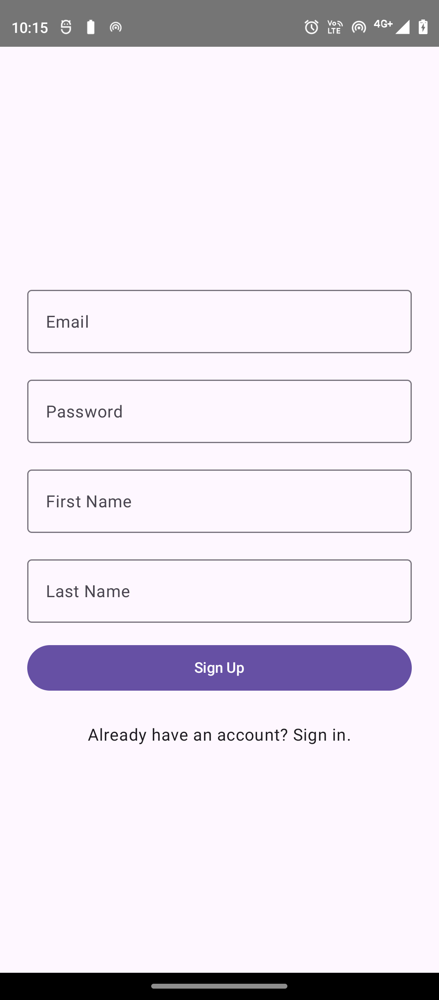
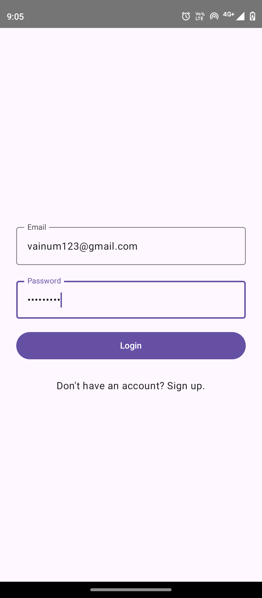
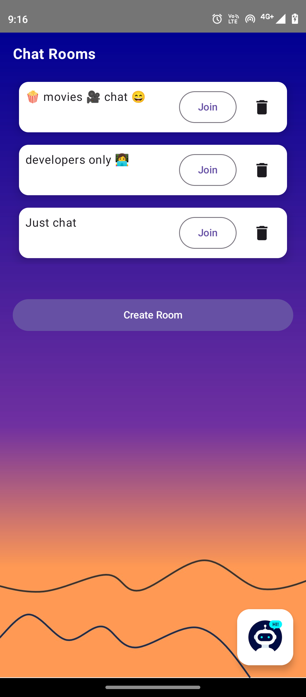
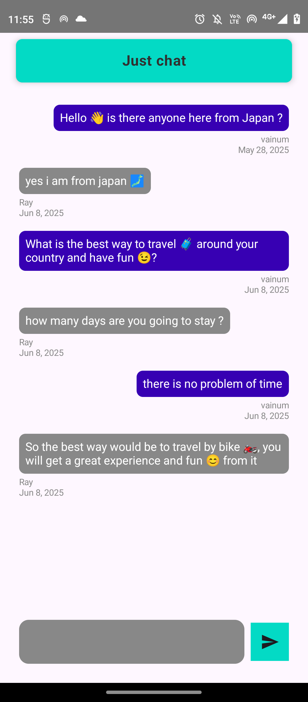
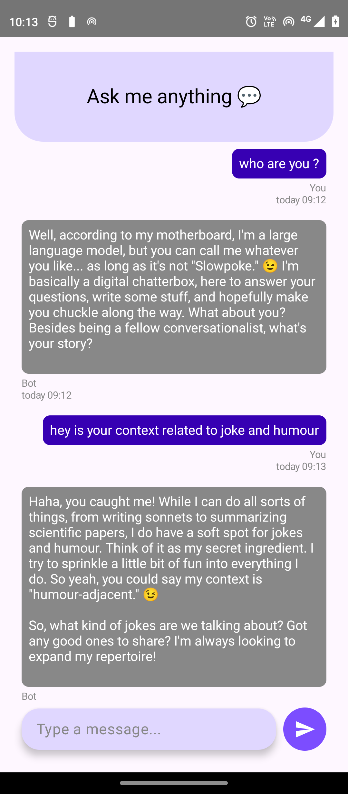

# 💬 ChatRealm – Real-Time Chat App with AI-Powered Conversations

A full-stack Android chat application built using **Jetpack Compose**, **Firebase**, and **Google's Gemini 2.0 API via the Build Chatbot with Gemini Firebase Extension**. ChatRealm allows users to create and join chatrooms, chat in real-time with others, and interact with an AI chatbot directly within the app.

---

## 🚀 Features

### ✅ Core Functionality
- 🔐 **User Authentication** – Sign up and log in using Firebase Authentication
- 💬 **Chatrooms** – Create, join, and delete chatrooms in real time
- 📡 **Real-Time Messaging** – Messages sync instantly via Firestore & Kotlin Flow
- 🤖 **AI Chatbot** – Integrated Gemini 2.0 Flash model via Firebase Extension
- 🧠 **MVVM Architecture** – Clean, testable code structure

---

## 🧠 Tech Stack

| Layer        | Tools/Frameworks                             |
|-------------|----------------------------------------------|
| UI          | Jetpack Compose, Material3, Kotlin           |
| Architecture| MVVM, LiveData, Kotlin Flow                  |
| Backend     | Firebase Authentication, Firestore           |
| AI          | Gemini 2.0 (via Build Chatbot with Gemini API Extension) |
| Monitoring  | Firebase Genkit (for performance tracking)   |
| Dev Tools   | Android Studio, Gradle, GitHub               |

---

## 🤖 Gemini 2.0 AI Integration

The app uses the **Build Chatbot with Gemini API** Firebase Extension to power chatbot conversations.

- Prompts are written to a Firestore collection (`bot-chats`)
- The extension reads the prompt, processes it using the **Gemini Flash model**, and writes the response back to Firestore
- Messages are rendered live in the chat interface
- Firebase Genkit is used to monitor response time and performance analytics

---

## 📸 Screenshots

| Sign Up | Login | Chatroom | Chat | AI Bot |
|--------|----------|------|--------|--------|
|  |  |  |  |  |


---

## 🔐 Recommended Firestore Rules

```js
rules_version = '2';
service cloud.firestore {
  match /databases/{database}/documents {

    // Bot chats: allow only the user who owns the chat
    match /bot-chats/{docId} {
      allow create: if request.auth != null && request.resource.data.userId == request.auth.uid;
      allow read: if request.auth != null && resource.data.userId == request.auth.uid;
    }

    // User documents: only allow access to their own document
    match /users/{userId} {
      allow read, write: if request.auth != null && request.auth.token.email == userId;
    }

    // Rooms: allow all authenticated users to read/write
    match /rooms/{roomId} {
      allow read, write: if request.auth != null;

      // Messages inside rooms
      match /messages/{messageId} {
        allow read, write: if request.auth != null;
      }
    }
  }
}
